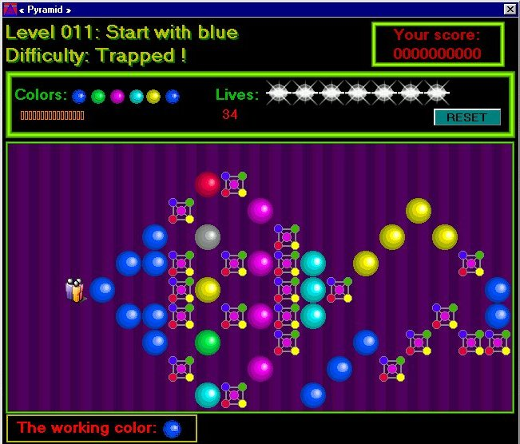



## Pyramid \!

### Description

A puzzle game, where you must find your way trough a maze of coloured balls. You can change the color of the ball you play with. There are 20 levels, music (midi), soundeffects (.wav), a high-score (saved !) and a cheat-mode (find it yourself). This prog handles some api. Included: all source, Pyramid.exe, 20 levels, midi and wav-files, graphics, highscore. Check it out and have fun. The zip is 224 kb.
 
### More Info
 
See Pyramid.txt

             |
---                |---
**Submitted On**   |2000-04-02 01:14:30
**By**             |[stephane swertvaegher](https://github.com/Planet-Source-Code/PSCIndex/blob/master/ByAuthor/stephane-swertvaegher.md)
**Level**          |Intermediate
**User Rating**    |4.8 (19 globes from 4 users)
**Compatibility**  |VB 5\.0, VB 6\.0
**Category**       |[Games](https://github.com/Planet-Source-Code/PSCIndex/blob/master/ByCategory/games__1-38.md)
**World**          |[Visual Basic](https://github.com/Planet-Source-Code/PSCIndex/blob/master/ByWorld/visual-basic.md)
**Archive File**   |[CODE\_UPLOAD4461412000\.zip](https://github.com/Planet-Source-Code/stephane-swertvaegher-pyramid__1-6940/archive/master.zip)

